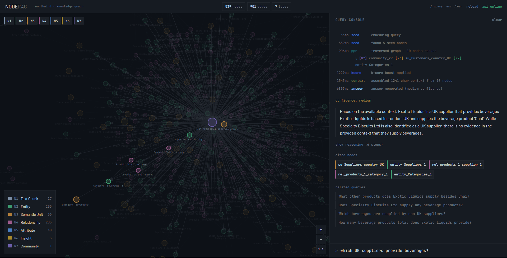

# NodeRAG: Structural Intelligence over Relational Databases

> Graph-based RAG system for multi-hop reasoning over relational databases



## Overview

NodeRAG is a graph-based Retrieval-Augmented Generation (RAG) system that transforms a relational
database into a heterogeneous knowledge graph and uses it to answer complex, multi-hop natural-language
questions. Instead of chunking table dumps into flat text, NodeRAG reifies every table row, foreign-key
relationship, schema column, and business insight as a typed graph node — then retrieves the most
relevant subgraph using Shallow Personalized PageRank (PPR) boosted by K-core decomposition before
sending structured context to Claude.

This implementation is built on the **Northwind** sample database (SQLite), a classic business dataset
covering Customers, Orders, Products, Suppliers, Employees, Categories, and OrderDetails across a
natural 4-level FK chain. The system implements the seven heterogeneous node types described in
*Xu et al. (2025) — NodeRAG: Structuring Graph-based RAG with Heterogeneous Nodes (arXiv:2504.11544)*,
extended with views, triggers, and check constraints extracted directly from the live database schema.

---

## Architecture

```
Northwind SQLite DB
        |
        v
 [bootstrap_northwind.py]
        |
        +-- Tables (7) + Views (5) + Triggers (5) + Indexes (7)
        |
        v
 [NorthwindHeterograph]
        |
        +-- N1: TextChunk nodes     (table/view/trigger schema chunks)
        +-- N2: Entity nodes        (one per DB row, up to 500/table)
        +-- N3: SemanticUnit nodes  (entity clusters by country/category/city)
        +-- N4: Relationship nodes  (FK instances reified as first-class nodes)
        +-- N5: Attribute nodes     (one per column, with business description)
        +-- N6: HighLevelInsight    (5 SQL-derived business analytics nodes)
        +-- N7: Community nodes     (K-core decomposed structural clusters)
        |
        v
 [NodeEmbedder]  all-MiniLM-L6-v2 -> 384-dim unit vectors
        |
        v
 [NodeIndex]  FAISS IndexFlatIP (cosine similarity)
        |
        v
 [NodeRAGRetriever]
        |
        +-- 1. Vector search -> seed nodes (N1-N6)
        +-- 2. Shallow PPR (2-hop neighbourhood, alpha=0.85)
        +-- 3. K-core boost (up to +50% for structurally central nodes)
        +-- 4. Context assembly (grouped by node type, ~3000 word budget)
        |
        v
 [NodeRAGAnswerer]  Claude API (prompt-cached system prompt + context)
        |
        v
 AnswerResult  (answer + reasoning_steps + cited_nodes + confidence + follow-ups)
```

---

## The 7 Node Types

| Type | Code | Description | Example from Northwind |
|------|------|-------------|------------------------|
| TextChunk | N1 | Raw schema chunk: table/view/trigger definition | "Table: Products, Columns: ProductID, ProductName, UnitPrice..." |
| Entity | N2 | One real-world row from any table | "Supplier: Exotic Liquids, based in London, UK. Contact: Charlotte Cooper." |
| SemanticUnit | N3 | LLM-summarised cluster of entities sharing a theme | "There are 3 products in the Beverages category. Price range: $4.50 - $19.00." |
| Relationship | N4 | FK instance reified as a node connecting two entities | "Order #10248 was placed by Customer VINET, shipping to France." |
| Attribute | N5 | Column-level fact with business description | "Products.UnitPrice: The price in USD charged per unit sold." |
| HighLevelInsight | N6 | Pre-computed SQL aggregate turned into a business sentence | "The top 3 revenue categories are Confections ($6,874), Meat/Poultry ($2,520), Seafood ($2,256)." |
| Community | N7 | Structurally cohesive K-core cluster of the graph backbone | "324 nodes at k-core level 2, centered around entity_Employees_4." |

---

## Why NodeRAG Beats Standard RAG for Databases

- **Multi-hop FK traversal**: Standard RAG would miss that answering *"Which UK suppliers' products
  were ordered by German customers?"* requires walking `Suppliers -> Products -> OrderDetails ->
  Orders -> Customers` — five tables, four hops. NodeRAG reifies each FK instance as an N4
  Relationship node that PPR can traverse in a single walk.

- **Structural importance via K-core**: Nodes like `Orders` sit at the junction of Customers,
  Employees, Products, and Shipping — they have high k-core numbers. NodeRAG boosts their PPR scores
  by up to 50%, ensuring the LLM always receives the most structurally central context first rather
  than the most lexically similar text.

- **Business logic is a first-class citizen**: The five database views
  (`SalesByCategory`, `CustomerOrderSummary`, `EmployeeSalesSummary`, etc.) and five triggers
  (`trg_prevent_discontinued_order`, `trg_decrement_stock_on_order`, etc.) are ingested as N1
  TextChunk nodes. When a query touches a trigger's domain, the LLM receives the actual trigger
  SQL as context — something a flat text RAG system would never surface.

- **Pre-computed analytics as N6 nodes**: SQL aggregates (top customers by revenue, most active
  employee, most expensive discontinued product) are materialised once at ingest time. A query like
  *"Who are the top customers?"* retrieves the insight node directly with a cosine score of 0.67+
  — no chain-of-thought arithmetic needed at query time.

---

## Running NodeRAG (from source)

NodeRAG is distributed as source code only — there is no pre-built binary. Two
runtime modes are supported: a CLI for terminal use, and a full-stack web app
(FastAPI backend + React/D3 frontend).

### Prerequisites

| Dependency | Version | Used for |
|---|---|---|
| Python | 3.10 + | backend, retrieval, LLM client |
| Node.js | 18 + | frontend dev server / build |
| Anthropic API key | n/a | LLM answer generation |

### 1. Install

```bash
git clone https://github.com/Chiraagrah/noderag_northwind
cd noderag_northwind

# Python
python -m venv .venv
.venv\Scripts\activate            # Windows
# source .venv/bin/activate       # macOS / Linux
pip install -e .

# Frontend (only if you plan to use the web app)
cd frontend && npm install && cd ..
```

Or, in one shot via `make`:

```bash
make install
```

### 2. Configure

```bash
cp .env.example .env
# edit .env, set:
#   ANTHROPIC_API_KEY=sk-ant-...
```

### 3. Build the knowledge graph and FAISS index (≈ 2 min)

```bash
python data/bootstrap_northwind.py     # downloads / generates Northwind SQLite
noderag ingest                          # graph + embeddings + FAISS index
# or:  make ingest
```

### 4. Run

**Option A — Web application (recommended)**

```bash
make dev
```

Opens two dev servers and forwards them through Vite:

- API on `http://localhost:8000`
- Frontend on `http://localhost:5173`  ← open this in your browser

For a single-process production-style run:

```bash
make build                                              # builds frontend into api/static/
uvicorn api.main:app --host 0.0.0.0 --port 8000        # one server on :8000
```

**Option B — CLI**

```bash
noderag ask "Which suppliers from the UK supply Beverages products?"
noderag interactive            # REPL
noderag ingest --enrich        # rebuild with LLM-enriched node descriptions
```

**Option C — Convenience launcher (Windows-friendly)**

```bash
python launcher.py
```

Spawns the API on :8000, the frontend on :5173, waits for the API to be ready,
then opens the browser automatically. Equivalent to `make dev` plus the browser
open step.

---

## Multi-Hop Query Examples

**Query 1 — Supplier + Category + Customer geography (3 hops)**
> *"Which suppliers from the UK supply products that were ordered by customers in Germany?"*

Reasoning chain:
`Suppliers[Country=UK]` -> `Products[SupplierID]` -> `OrderDetails[ProductID]` ->
`Orders[OrderID]` -> `Customers[Country=Germany]`

---

**Query 2 — Employee hierarchy + Order revenue (2 hops)**
> *"What is the total revenue from orders handled by employees who report to the same manager as Janet Leverling?"*

Reasoning chain:
`Employees[Janet Leverling]` -> `Employees[ReportsTo=2]` -> `Orders[EmployeeID]` ->
`OrderDetails[UnitPrice * Quantity * (1-Discount)]`

---

**Query 3 — Category + Discount aggregation (2 hops)**
> *"Which product categories have the highest average discount rate?"*

Reasoning chain:
`Categories` -> `Products[CategoryID]` -> `OrderDetails[ProductID, Discount]`

---

**Query 4 — Discontinued products + Order history (3 hops)**
> *"Which customers have ordered products that are now discontinued?"*

Reasoning chain:
`Products[Discontinued=1]` -> `OrderDetails[ProductID]` -> `Orders[OrderID]` ->
`Customers[CustomerID]`

---

**Query 5 — Top customers + Shipping analysis (2 hops)**
> *"What is the shipping profile of our top 3 revenue-generating customers?"*

Reasoning chain:
`N6 insight[top_customers_by_revenue]` -> `Orders[CustomerID, ShipCountry, Freight]`

---

## How Retrieval Works

```
Query text
    |
    v  embed_text()  [all-MiniLM-L6-v2]
Query vector (384-dim, L2-normalised)
    |
    v  FAISS IndexFlatIP  top-K inner product search
Seed nodes  (N1-N6 only, Community nodes excluded from seeding)
    |
    v  ShallowPPR  (alpha=0.85, 2-hop neighbourhood restriction)
PPR scores  (personalised PageRank biased toward seed set)
    |
    v  KCoreRanker  (multiplier = 1 + core_number/max_core * 0.5)
Boosted scores  (structurally central nodes get up to +50%)
    |
    v  _assemble_context()  (grouped by node type, ~3000 word budget)
Structured context string
    |
    v  Claude API  (system prompt + context, both prompt-cached)
AnswerResult  (answer, reasoning_steps, cited_nodes, confidence, follow_ups)
```

The **"shallow"** in Shallow PPR means the random walk is restricted to nodes
within 2 hops of the seed set. This prevents globally popular nodes (like the
K-core community hub) from dominating results when the query is narrowly focused.

---

## Configuration

All settings are loaded from `.env` (copy `.env.example` to get started).

| Variable | Default | Description |
|----------|---------|-------------|
| `ANTHROPIC_API_KEY` | *(required)* | Your Anthropic API key (`sk-ant-...`) |
| `EMBED_MODEL` | `all-MiniLM-L6-v2` | Sentence-transformers model for node embedding |
| `LLM_MODEL` | `claude-haiku-4-5-20251001` | Claude model ID for answer generation |
| `DB_PATH` | `data/northwind.db` | Path to the SQLite database |
| `TOP_K_RETRIEVAL` | `10` | Number of nodes returned by the retrieval pipeline |
| `PPR_ALPHA` | `0.85` | PPR damping factor (probability of following an edge) |
| `PPR_MAX_ITER` | `100` | Maximum PageRank iterations |
| `KCORE_MIN_K` | `2` | Minimum k-core level to include in community nodes |

---

## Project Structure

```
noderag_northwind/
|
+-- cli.py                     Click CLI: ingest / ask / interactive / stats / demo
+-- config.py                  Loads all env vars; single source of truth for settings
+-- pyproject.toml             Package definition + noderag entry-point script
+-- requirements.txt           Pinned dependency list
+-- .env.example               Template for environment configuration
+-- README.md                  This file
|
+-- data/
|   +-- bootstrap_northwind.py Downloads or generates Northwind DB; extracts schema JSON
|   +-- northwind.db           SQLite database (7 tables, 5 views, 5 triggers, 7 indexes)
|   +-- northwind_schema.json  Extracted schema with columns, FKs, checks, sample rows
|   +-- northwind_graph.json   Serialised NetworkX MultiDiGraph (539 nodes, 901 edges)
|   +-- northwind_index.faiss  FAISS IndexFlatIP over 384-dim node embeddings
|   +-- northwind_index.json   Node ID list + serialised node data for index lookup
|
+-- graph/
|   +-- node_types.py          Pydantic models for all 7 node types + AnyNode union
|   +-- heterograph.py         NorthwindHeterograph: builds the full graph from DB + schema
|   +-- embedder.py            NodeEmbedder: sentence-transformer batch embedding
|   +-- indexer.py             NodeIndex: FAISS build / search / save / load
|
+-- retrieval/
|   +-- ppr.py                 ShallowPPR: personalised PageRank + 2-hop filter + explain()
|   +-- kcore.py               KCoreRanker: k-core decomposition + structural score boost
|   +-- retriever.py           NodeRAGRetriever + RetrievalResult: full 5-stage pipeline
|
+-- llm/
|   +-- extractor.py           GraphEnricher: LLM-generated column/summary/insight text
|   +-- answerer.py            NodeRAGAnswerer + AnswerResult: Claude API answer generation
|
+-- pipeline/
    +-- ingest.py              IngestionPipeline: DB -> graph -> embed -> index (6 steps)
    +-- query.py               QueryPipeline: load -> ask -> interactive REPL
```

---

## Troubleshooting

| Problem | Likely Cause | Fix |
|---------|-------------|-----|
| `faiss` import error | CPU/GPU mismatch | `pip install faiss-cpu --force-reinstall` |
| Empty PPR results | Graph disconnected | Check FK relationship nodes connect to entity nodes |
| LLM timeout | Context too large | Reduce `TOP_K_RETRIEVAL` in `.env` |
| Poor answer quality | No LLM enrichment | Re-run `noderag ingest --enrich` |
| Slow embedding | CPU-only, large graph | Set `LIMIT 200` in `heterograph._build_entity_nodes` |
| `UnicodeEncodeError` on Windows | cp1252 terminal | The `_safe()` sanitizer in `answerer.py` handles this |
| `ANTHROPIC_API_KEY not set` | `.env` not found | Ensure `.env` exists in the project root |

---

*Based on: Xu et al. (2025). NodeRAG: Structuring Graph-based RAG with Heterogeneous Nodes. arXiv:2504.11544*

---

## Frontend

A full-stack web application that exposes the NodeRAG pipeline as a visual knowledge-graph explorer
and natural-language query interface. Stack: React 18 + Vite · D3.js v7 · FastAPI · Tailwind CSS ·
Framer Motion. See *Running NodeRAG* above for installation and run commands.

### Features

| Feature | Notes |
|---|---|
| Force-directed graph | D3 v7, 7 muted node colors, size by k-core number |
| Node type filtering | FilterBar toggles visibility per type |
| Node inspector | Click any node to inspect full data and connections |
| Subgraph expansion | "expand subgraph" merges 2-hop neighborhood live |
| Natural language query | Keyboard-first input at bottom of right panel |
| Retrieval step log | Plain text log of seed → PPR → k-core → context |
| Highlight on retrieval | PPR nodes change opacity; dimmed nodes recede |
| Cited node tokens | Click any cited ID to jump to that node in graph |
| Follow-up queries | Suggested queries rendered as text links |
| Keyboard shortcuts | / = focus input, Esc = clear, Ctrl+R = reload |

### Design Decisions

**D3 in a React ref, not a React component**

`GraphRenderer.js` handles all D3 DOM mutations. React never touches the SVG after the initial
render. This prevents the force simulation from restarting on every state change. The renderer
instance lives in `useRef` inside `useD3Graph`, which means instantiating it never triggers a
React re-render.

**Two Zustand stores, not one**

`graphStore` and `queryStore` are independent. A query update does not cause the graph canvas to
re-render. They share data only through explicit actions (`setHighlights`, `selectNode`). Keeping
them separate means D3 animation frames and React render cycles never compete.

**SSE over POST**

The native `EventSource` API does not support POST bodies. The `queryStream` async generator in
`api.js` uses `fetch()` + `ReadableStream` instead, which works through the Vite proxy and
supports the full `QueryRequest` payload. The Vite proxy is configured with `proxyTimeout: 0` so
long-running LLM calls are never dropped.

**No decorative effects**

The interface uses opacity, color, and border-weight as the only visual signals. There are no
gradients on data surfaces, no glow filters, no particle effects. Every visual decision is
functional. The only continuous animation is the idle graph drift — a subtle sinusoidal offset
applied after the force simulation settles, to signal the graph is live.
